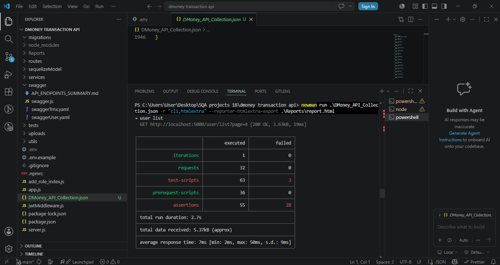
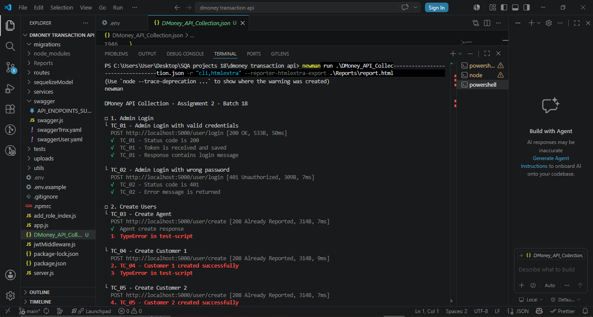
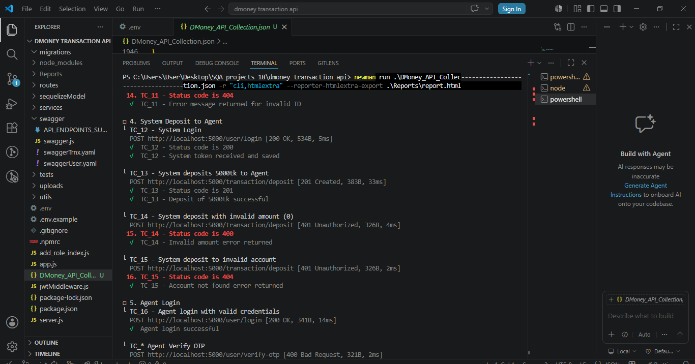

# DMoney API Integration Testing 

## Project Overview
This project shows how to test the DMoney Transaction API using Postman

## Tested Workflow
- Admin Login
- Create Agent
- Create Customer 1
- Create Customer 2
- Activate Users
- System Deposit to Agent
- Agent Deposit to Customer
- Customer Send Money
- Customer Cashout

## Technologies Used
- Postman
- Newman
- Node.js
- HTML Extra Reporter

## Test Cases
Positive and negative test cases were implemented inside the Postman collection.

## Newman Report
Newman HTML report is included inside the `Reports` folder.

## Newman Report Screenshot

## Collection Run Result

## API Documentation

## Git Ignore Includes
- node_modules/
- Reports/
- .env
